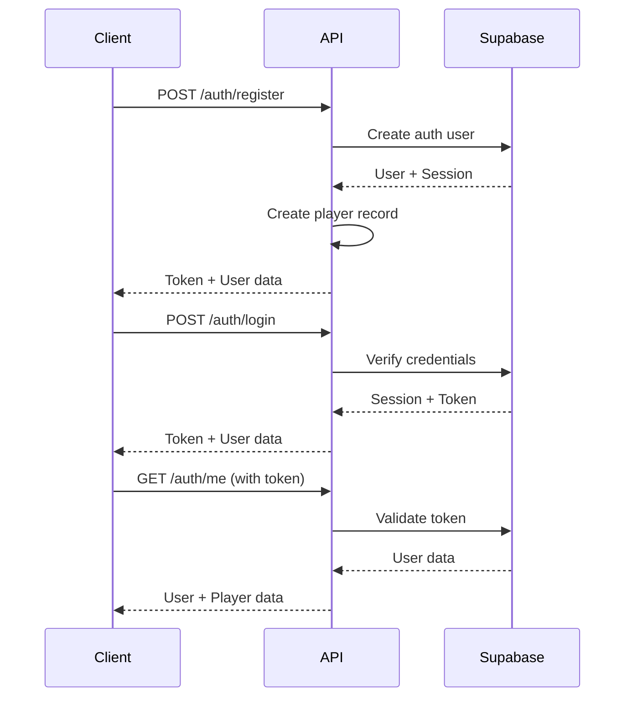

# Rugby Team API - Complete Developer Documentation

**Version:** 1.0.0  
**Base URL:** `http://localhost:3000/api`  
**Production URL:** `https://api.yourteam.com` (when deployed)

---

## Table of Contents

1. [Quick Start](#quick-start)
2. [Authentication](#authentication)
3. [Data Models](#data-models)
4. [API Endpoints](#api-endpoints)
5. [Use Cases](#use-cases)
6. [Error Handling](#error-handling)
7. [Examples](#examples)

---

## Quick Start

### Prerequisites
- Node.js 16+
- Supabase account and project
- API credentials (see `.env.example`)

### Running the API
```bash
npm install
npm run dev
```

### Interactive Documentation
- **Swagger UI**: http://localhost:3000/api-docs
- **Test Interface**: http://localhost:3000/auth-test.html

### OpenAPI Spec
Download at: http://localhost:3000/api-docs.json

---

## Authentication

### Overview
The API uses **Supabase Auth** with **JWT Bearer tokens**.

### Authentication Flow



### Endpoints

#### Register New User
```http
POST /api/auth/register
Content-Type: application/json

{
  "email": "player@team.com",
  "password": "securepass123",
  "player_name": "Juan Pérez",
  "date_of_birth": "1995-05-15",
  "curp": "PEXJ950515HDFRNN01",
  "team_id": "uuid-of-team",
  "federation_id": 12345,
  "phone_number": "+525512345678",
  "category": "Senior"
}
```

**Response:**
```json
{
  "success": true,
  "data": {
    "token": "eyJhbGciOiJIUzI1NiIs...",
    "user": { "id": "...", "email": "..." },
    "player": { "id": 1, "player_name": "Juan Pérez", ... }
  }
}
```

#### Login
```http
POST /api/auth/login
Content-Type: application/json

{
  "email": "player@team.com",
  "password": "securepass123"
}
```

**Response:**
```json
{
  "success": true,
  "data": {
    "token": "eyJhbGciOiJIUzI1NiIs...",
    "user": { ... },
    "player": { ... }
  }
}
```

#### Get Current User
```http
GET /api/auth/me
Authorization: Bearer {token}
```

### Using Authentication

All authenticated requests must include the token:

```javascript
fetch('http://localhost:3000/api/endpoint', {
  headers: {
    'Authorization': 'Bearer YOUR_TOKEN_HERE'
  }
});
```

---

## Data Models

### Team
```typescript
{
  id: string (UUID)
  name: string
  region: string
  created_at: datetime
  updated_at: datetime
}
```

### Player
```typescript
{
  id: number
  team_id: string (UUID)
  auth_user_id: string (UUID) // Links to Supabase auth
  player_name: string
  date_of_birth: date
  curp: string (unique)
  short_size: string | null
  jersey_size: string | null
  email: string (unique)
  phone_number: string | null
  password: string (managed by Supabase)
  federation_id: number (unique)
  eligibility: boolean
  category: string | null
  profile_picture: string | null
  created_at: datetime
  updated_at: datetime
}
```

### PlayerNumber
```typescript
{
  id: number
  player_id: number
  team_id: string (UUID)
  player_number: number (unique)
  created_at: datetime
  updated_at: datetime
}
```

### Affiliations
```typescript
{
  id: number
  player_id: number (unique)
  federation: boolean
  association: boolean
  created_at: datetime
  updated_at: datetime
}
```

### Payments
```typescript
{
  id: number
  player_id: number (unique)
  total_payed: number (in cents)
  total_debt: number (in cents)
  debt: boolean
  created_at: datetime
  updated_at: datetime
}
```

### Admin
```typescript
{
  id: number
  player_id: number (unique)
  role: string
  created_at: datetime
  updated_at: datetime
}
```

### Season
```typescript
{
  id: number
  modality: string (e.g., "15s", "7s")
  name: string (unique)
  created_at: datetime
  updated_at: datetime
}
```

### Stats
```typescript
{
  id: number
  player_id: number
  season_id: number
  yellow_card: number
  red_card: number
  try: number
  drop: number
  conversion: number
  penalty_scored: number
  points: number
  created_at: datetime
  updated_at: datetime
}
```

---

## API Endpoints

### Authentication Endpoints

| Method | Endpoint | Auth | Description |
|--------|----------|------|-------------|
| POST | `/auth/register` | No | Register new user |
| POST | `/auth/login` | No | Login |
| POST | `/auth/logout` | No | Logout |
| GET | `/auth/me` | Yes | Get current user |
| POST | `/auth/forgot-password` | No | Request password reset |

### Team Endpoints

| Method | Endpoint | Auth | Description |
|--------|----------|------|-------------|
| GET | `/teams` | No | Get all teams |
| GET | `/teams/:id` | No | Get team by ID |
| POST | `/teams` | Optional | Create team |
| PUT | `/teams/:id` | Optional | Update team |
| DELETE | `/teams/:id` | Optional | Delete team |

### Player Endpoints

| Method | Endpoint | Auth | Description |
|--------|----------|------|-------------|
| GET | `/players` | No | Get all players |
| GET | `/players/:id` | No | Get player by ID |
| GET | `/players/team/:teamId` | No | Get players by team |
| POST | `/players` | Optional | Create player |
| PUT | `/players/:id` | Yes | Update player |
| DELETE | `/players/:id` | Yes+Admin | Delete player |

### Player Number Endpoints

| Method | Endpoint | Auth | Description |
|--------|----------|------|-------------|
| GET | `/player-numbers` | No | Get all player numbers |
| GET | `/player-numbers/player/:playerId` | No | Get by player ID |
| POST | `/player-numbers` | Yes | Assign number |
| PUT | `/player-numbers/:id` | Yes | Update number |
| DELETE | `/player-numbers/:id` | Yes+Admin | Remove number |

### Affiliation Endpoints

| Method | Endpoint | Auth | Description |
|--------|----------|------|-------------|
| GET | `/affiliations` | No | Get all affiliations |
| GET | `/affiliations/player/:playerId` | No | Get by player |
| POST | `/affiliations` | Yes | Create affiliation |
| PUT | `/affiliations/:id` | Yes | Update affiliation |
| DELETE | `/affiliations/:id` | Yes+Admin | Delete affiliation |

### Payment Endpoints 💰

| Method | Endpoint | Auth | Description |
|--------|----------|------|-------------|
| GET | `/payments` | Yes+Admin | Get all payments |
| GET | `/payments/player/:playerId` | Yes | Get by player |
| **GET** | **`/payments/debt`** | Yes+Admin | **Get players with debt** |
| POST | `/payments` | Yes | Create payment record |
| PUT | `/payments/:id` | Yes | Update payment |
| DELETE | `/payments/:id` | Yes+Admin | Delete payment |

### Admin Endpoints

| Method | Endpoint | Auth | Description |
|--------|----------|------|-------------|
| GET | `/admins` | Yes+Admin | Get all admins |
| GET | `/admins/player/:playerId` | Yes | Get by player |
| POST | `/admins` | Yes+Admin | Create admin |
| PUT | `/admins/:id` | Yes+Admin | Update admin |
| DELETE | `/admins/:id` | Yes+Admin | Remove admin |

### Season Endpoints

| Method | Endpoint | Auth | Description |
|--------|----------|------|-------------|
| GET | `/seasons` | No | Get all seasons |
| GET | `/seasons/:id` | No | Get season by ID |
| POST | `/seasons` | Yes+Admin | Create season |
| PUT | `/seasons/:id` | Yes+Admin | Update season |
| DELETE | `/seasons/:id` | Yes+Admin | Delete season |

### Stats Endpoints 📊

| Method | Endpoint | Auth | Description |
|--------|----------|------|-------------|
| GET | `/stats` | No | Get all stats |
| GET | `/stats/:id` | No | Get stats by ID |
| **GET** | **`/stats/player/:playerId`** | No | **Get all stats for a player** |
| **GET** | **`/stats/season/:seasonId`** | No | **Get all stats for a season** |
| POST | `/stats` | Yes | Create stats |
| PUT | `/stats/:id` | Yes | Update stats |
| DELETE | `/stats/:id` | Yes+Admin | Delete stats |

---

## Use Cases

### For Finance App

#### 1. View All Players with Debt
```http
GET /api/payments/debt
Authorization: Bearer {admin_token}
```

**Response:**
```json
{
  "success": true,
  "data": [
    {
      "id": 1,
      "player_id": 5,
      "total_payed": 5000,
      "total_debt": 3000,
      "debt": true
    }
  ]
}
```

#### 2. Get Player's Payment History
```http
GET /api/payments/player/5
Authorization: Bearer {token}
```

#### 3. Record a Payment
```http
POST /api/payments
Authorization: Bearer {token}
Content-Type: application/json

{
  "player_id": 5,
  "total_payed": 8000,
  "total_debt": 0,
  "debt": false
}
```

#### 4. Update Payment Status
```http
PUT /api/payments/1
Authorization: Bearer {token}
Content-Type: application/json

{
  "total_payed": 10000,
  "total_debt": 0,
  "debt": false
}
```

#### Finance App Workflow
```javascript
// 1. Login as admin
const { data } = await login(email, password);
const token = data.token;

// 2. Get all players with debt
const debtors = await fetch('/api/payments/debt', {
  headers: { 'Authorization': `Bearer ${token}` }
});

// 3. Display in UI
debtors.data.forEach(payment => {
  // Show player name, debt amount, etc.
});

// 4. Record payment
await fetch('/api/payments', {
  method: 'POST',
  headers: {
    'Authorization': `Bearer ${token}`,
    'Content-Type': 'application/json'
  },
  body: JSON.stringify({
    player_id: playerId,
    total_payed: newTotal,
    debt: false
  })
});
```

---

### For Match Statistics App

#### 1. Get All Seasons
```http
GET /api/seasons
```

**Response:**
```json
{
  "success": true,
  "data": [
    {
      "id": 1,
      "modality": "15s",
      "name": "Temporada 2024",
      "created_at": "2024-01-01T00:00:00Z"
    }
  ]
}
```

#### 2. Get Player Stats for a Season
```http
GET /api/stats/season/1
```

**Response:**
```json
{
  "success": true,
  "data": [
    {
      "id": 1,
      "player_id": 5,
      "season_id": 1,
      "yellow_card": 1,
      "red_card": 0,
      "try": 5,
      "conversion": 3,
      "points": 31
    }
  ]
}
```

#### 3. Get All Stats for a Player
```http
GET /api/stats/player/5
```

#### 4. Record Match Statistics
```http
POST /api/stats
Authorization: Bearer {token}
Content-Type: application/json

{
  "player_id": 5,
  "season_id": 1,
  "try": 2,
  "conversion": 1,
  "penalty_scored": 0,
  "yellow_card": 0,
  "red_card": 0,
  "points": 12
}
```

#### 5. Update Stats After Match
```http
PUT /api/stats/1
Authorization: Bearer {token}
Content-Type: application/json

{
  "try": 7,
  "points": 43
}
```

#### Stats App Workflow
```javascript
// 1. Get current season
const seasons = await fetch('/api/seasons');
const currentSeason = seasons.data[0];

// 2. Get team players
const players = await fetch(`/api/players/team/${teamId}`);

// 3. Get stats for this season
const stats = await fetch(`/api/stats/season/${currentSeason.id}`);

// 4. After match, record stats
for (const playerStat of matchStats) {
  await fetch('/api/stats', {
    method: 'POST',
    headers: {
      'Authorization': `Bearer ${token}`,
      'Content-Type': 'application/json'
    },
    body: JSON.stringify({
      player_id: playerStat.playerId,
      season_id: currentSeason.id,
      try: playerStat.tries,
      conversion: playerStat.conversions,
      points: playerStat.totalPoints
    })
  });
}

// 5. Display leaderboard
const sortedStats = stats.data.sort((a, b) => b.points - a.points);
```

---

## Error Handling

### Standard Response Format

**Success:**
```json
{
  "success": true,
  "data": { ... }
}
```

**Error:**
```json
{
  "success": false,
  "error": "Error message here"
}
```

### HTTP Status Codes

| Code | Meaning | When |
|------|---------|------|
| 200 | OK | Successful GET/PUT/DELETE |
| 201 | Created | Successful POST |
| 400 | Bad Request | Invalid input data |
| 401 | Unauthorized | Missing/invalid token |
| 403 | Forbidden | Insufficient permissions |
| 404 | Not Found | Resource doesn't exist |
| 500 | Server Error | Internal error |

---

## Examples

### Complete Finance App Example

```javascript
// Finance Dashboard
class FinanceApp {
  constructor(apiUrl, token) {
    this.apiUrl = apiUrl;
    this.token = token;
  }

  async getPlayersWithDebt() {
    const response = await fetch(`${this.apiUrl}/payments/debt`, {
      headers: { 'Authorization': `Bearer ${this.token}` }
    });
    return response.json();
  }

  async recordPayment(playerId, amount) {
    // Get current payment record
    const current = await fetch(`${this.apiUrl}/payments/player/${playerId}`, {
      headers: { 'Authorization': `Bearer ${this.token}` }
    }).then(r => r.json());

    // Calculate new totals
    const newTotalPayed = current.data.total_payed + amount;
    const newDebt = current.data.total_debt - amount;

    // Update payment
    return fetch(`${this.apiUrl}/payments/${current.data.id}`, {
      method: 'PUT',
      headers: {
        'Authorization': `Bearer ${this.token}`,
        'Content-Type': 'application/json'
      },
      body: JSON.stringify({
        total_payed: newTotalPayed,
        total_debt: Math.max(0, newDebt),
        debt: newDebt > 0
      })
    });
  }

  async getPlayerPaymentHistory(playerId) {
    const response = await fetch(`${this.apiUrl}/payments/player/${playerId}`, {
      headers: { 'Authorization': `Bearer ${this.token}` }
    });
    return response.json();
  }
}

// Usage
const app = new FinanceApp('http://localhost:3000/api', userToken);
const debtors = await app.getPlayersWithDebt();
await app.recordPayment(5, 1000); // Record 1000 pesos payment
```

### Complete Stats App Example

```javascript
// Match Statistics Tracker
class StatsApp {
  constructor(apiUrl, token) {
    this.apiUrl = apiUrl;
    this.token = token;
  }

  async getCurrentSeason() {
    const response = await fetch(`${this.apiUrl}/seasons`);
    const data = await response.json();
    return data.data[0]; // Latest season
  }

  async getSeasonLeaderboard(seasonId) {
    const response = await fetch(`${this.apiUrl}/stats/season/${seasonId}`);
    const data = await response.json();
    
    // Sort by points
    return data.data.sort((a, b) => b.points - a.points);
  }

  async recordMatchStats(seasonId, playerStats) {
    const promises = playerStats.map(stat => 
      fetch(`${this.apiUrl}/stats`, {
        method: 'POST',
        headers: {
          'Authorization': `Bearer ${this.token}`,
          'Content-Type': 'application/json'
        },
        body: JSON.stringify({
          player_id: stat.playerId,
          season_id: seasonId,
          yellow_card: stat.yellowCards || 0,
          red_card: stat.redCards || 0,
          try: stat.tries || 0,
          conversion: stat.conversions || 0,
          drop: stat.drops || 0,
          penalty_scored: stat.penalties || 0,
          points: stat.totalPoints
        })
      })
    );

    return Promise.all(promises);
  }

  async getPlayerCareerStats(playerId) {
    const response = await fetch(`${this.apiUrl}/stats/player/${playerId}`);
    const data = await response.json();
    
    // Aggregate across all seasons
    return data.data.reduce((totals, stat) => ({
      tries: totals.tries + stat.try,
      conversions: totals.conversions + stat.conversion,
      points: totals.points + stat.points,
      yellowCards: totals.yellowCards + stat.yellow_card,
      redCards: totals.redCards + stat.red_card
    }), { tries: 0, conversions: 0, points: 0, yellowCards: 0, redCards: 0 });
  }
}

// Usage
const stats = new StatsApp('http://localhost:3000/api', userToken);
const season = await stats.getCurrentSeason();
const leaderboard = await stats.getSeasonLeaderboard(season.id);

// After match
await stats.recordMatchStats(season.id, [
  { playerId: 5, tries: 2, conversions: 1, totalPoints: 12 },
  { playerId: 7, tries: 1, conversions: 0, totalPoints: 5 }
]);
```

---

## Database Schema

### Entity Relationship Diagram

```
┌─────────┐         ┌─────────────┐         ┌──────────────┐
│  Team   │────────<│   Player    │>────────│ PlayerNumber │
└─────────┘         └─────────────┘         └──────────────┘
                           │
                           │
            ┌──────────────┼──────────────┐
            │              │              │
            ▼              ▼              ▼
    ┌─────────────┐ ┌──────────┐  ┌───────┐
    │Affiliations │ │ Payments │  │ Admin │
    └─────────────┘ └──────────┘  └───────┘
                           
┌────────┐         ┌───────┐
│ Season │────────<│ Stats │>──────┐
└────────┘         └───────┘       │
                        ▲           │
                        └───────────┘
                          Player
```

### Key Relationships

- **Team** → **Player**: One-to-Many
- **Player** → **PlayerNumber**: One-to-One
- **Player** → **Affiliations**: One-to-One
- **Player** → **Payments**: One-to-One
- **Player** → **Admin**: One-to-One (optional)
- **Player** → **Stats**: One-to-Many
- **Season** → **Stats**: One-to-Many

---

## Getting Started for AI Agents

### Prompt Template for Building Finance App

```
You are building a finance tracking app for a Rugby team.

API Base URL: http://localhost:3000/api
Authentication: JWT Bearer tokens (use /auth/login first)

Key Endpoints:
- GET /payments/debt - Get all players with outstanding debt
- GET /payments/player/:id - Get payment info for specific player
- POST /payments - Create payment record
- PUT /payments/:id - Update payment

Requirements:
1. Admin login page
2. Dashboard showing all players with debt
3. Payment recording form
4. Payment history view
5. Export to PDF/Excel

See full API docs at: http://localhost:3000/api-docs
```

### Prompt Template for Building Stats App

```
You are building a match statistics tracking app for a Rugby team.

API Base URL: http://localhost:3000/api
Authentication: JWT Bearer tokens (use /auth/login first)

Key Endpoints:
- GET /seasons - Get all seasons
- GET /stats/season/:seasonId - Get all stats for a season
- GET /stats/player/:playerId - Get player career stats
- POST /stats - Record match statistics

Requirements:
1. Match entry form (per player: tries, conversions, cards, etc.)
2. Season leaderboard (sort by points)
3. Player profile with career stats
4. Match history
5. Statistics visualization (charts/graphs)

See full API docs at: http://localhost:3000/api-docs
```

---

## Support

- **Swagger UI**: http://localhost:3000/api-docs
- **Test Interface**: http://localhost:3000/auth-test.html
- **OpenAPI Spec**: http://localhost:3000/api-docs.json
- **Source Code**: All controllers in `src/controllers/`
- **Database Migrations**: `supabase/migrations/`

---

**Last Updated:** 2025-11-18  
**API Version:** 1.0.0
